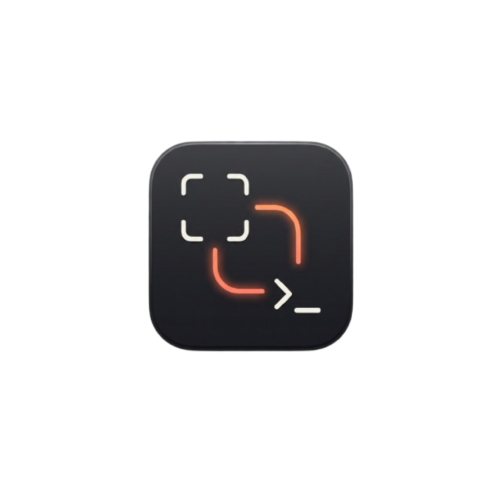

<p align="center">
  
</p>

<h1 align="center">ScreenPipe</h1>

<p align="center">
  A floating terminal mirror for Claude Code — see your terminal on top of any app.<br>
  Supports Terminal.app and iTerm2. Free and open source.
</p>

## What it does

- Lives in the menu bar, no dock icon.
- Two global hotkeys (work anywhere, even when the app isn't focused):
  - **⌃⇧⌘1** — full-screen capture (default)
  - **⌃⇧⌘2** — drag-select area capture (default)
- After the capture, a small HUD popup appears centered on screen with a focused
  text field.
  - Press **Return** — popup closes, the terminal app you were just in comes
    back to the front, and the screenshot's file path (plus any message you
    typed) is pasted and sent with a Return keystroke.
  - Press **Escape** — the screenshot is deleted and nothing is pasted.
- Change both hotkeys from the menu-bar icon → **Settings…**.

Screenshots are saved to `~/Library/Caches/ScreenPipe/` (cancelled ones are
deleted immediately).

## Build

```bash
cd ~/ScreenPipe
./build.sh
```

That produces `build/ScreenPipe.app`. Run it:

```bash
open build/ScreenPipe.app
```

or drag it into `/Applications` and launch normally. Requires macOS 13 or later.

The build script ad-hoc signs the app. On first launch, macOS may still warn
about an unidentified developer — right-click the app → **Open** → **Open** to
bypass. Subsequent launches work normally.

## Permissions (granted the first time you use it)

On first launch ScreenPipe will ask for the two permissions it needs. You can
also re-open the prompts from the menu-bar icon → **Grant Permissions…**.

1. **Screen Recording** — required to take screenshots.
   *System Settings → Privacy & Security → Screen Recording* → enable
   **ScreenPipe**.
2. **Accessibility** — required to paste into the terminal and to send the
   Return keystroke that submits your message.
   *System Settings → Privacy & Security → Accessibility* → enable
   **ScreenPipe**.

After granting, quit and relaunch ScreenPipe once so the permission takes
effect.

## Using it with Claude Code

1. Focus your terminal running Claude Code.
2. Hit your hotkey. For drag-select, drag the region you want; for full-screen,
   the whole display is captured instantly.
3. The composer pops up. Type an optional message like
   "what's wrong with this UI?" or just leave it blank.
4. Press **Return**. You'll see your terminal come back to the front and the
   screenshot path get pasted and submitted — Claude Code reads the file and
   replies.

If you cancel with **Escape** the screenshot is discarded and you're right back
where you started.

## Files

```
ScreenPipe/
├── Info.plist
├── build.sh
├── Sources/
│   ├── main.swift               # entry point
│   ├── AppDelegate.swift        # app lifecycle
│   ├── MenuBarController.swift  # status item + orchestration
│   ├── Hotkey.swift             # hotkey model + keycode names
│   ├── HotkeyManager.swift      # Carbon RegisterEventHotKey wrapper
│   ├── Preferences.swift        # UserDefaults-backed settings
│   ├── ScreenshotService.swift  # wraps /usr/sbin/screencapture
│   ├── Composer.swift           # floating HUD popup with text field
│   ├── Settings.swift           # shortcut-recorder UI
│   ├── Paster.swift             # clipboard + ⌘V + ↩ synthesis
│   └── Permissions.swift        # first-run prompts
└── README.md
```

## Rebuild / iterate

Edit any file under `Sources/` and re-run `./build.sh`. If the app is already
running, quit it first from the menu-bar icon.
